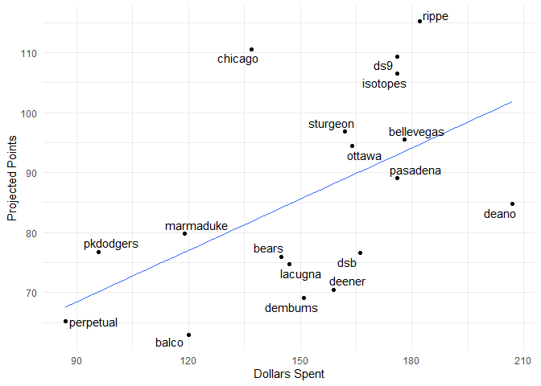
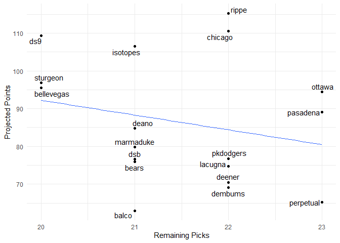

Fantasy 2021
================

#### Today's auction

#### Draft Status

| position    |  remaining|   max|   avg|
|:------------|----------:|-----:|-----:|
| 1b          |         20|  23.2|  12.4|
| 1b, 2b      |          1|   3.8|   3.8|
| 1b, 3b      |          2|  14.3|  12.7|
| 1b, catcher |          1|   1.1|   1.1|
| 1b, dh      |          5|  12.7|   8.1|
| 1b, of      |          5|  16.9|  11.1|
| 2b          |         16|  22.1|   9.5|
| 2b, 3b      |          7|  17.5|   8.8|
| 2b, 3b, ss  |          1|   4.3|   4.3|
| 2b, of      |          6|  14.3|   6.8|
| 2b, ss      |          9|  24.1|  12.3|
| 3b          |         17|  20.6|  11.6|
| 3b, catcher |          1|  14.2|  14.2|
| 3b, dh      |          1|  12.3|  12.3|
| 3b, dh, of  |          1|   2.5|   2.5|
| 3b, of      |          3|  17.4|  16.3|
| 3b, ss      |          1|   5.9|   5.9|
| catcher     |         29|  13.1|   5.2|
| dh          |          2|  19.5|  17.8|
| dh, of      |          7|  23.6|  10.8|
| of          |         82|  27.4|  10.4|
| of, ss      |          3|  17.8|  14.6|
| ss          |         19|  19.7|  12.9|
| pitcher     |        121|  23.7|   6.4|

| name  |  value|
|:------|------:|
| 1B    |      6|
| 2B    |      6|
| 3B    |      9|
| CI    |     16|
| DH    |     14|
| MI    |     16|
| SS    |      7|
| C     |     28|
| OF    |     58|
| P     |    116|
| Total |    276|

#### Current Standings

| team       |  total\_points|  hit\_points|  pitch\_points|
|:-----------|--------------:|------------:|--------------:|
| rippe      |          102.3|         45.6|           56.7|
| sturgeon   |          101.3|         61.3|           40.0|
| ds9        |           90.5|         41.5|           49.0|
| chicago    |           83.7|         28.8|           54.9|
| bellevegas |           78.8|         43.7|           35.1|
| pkdodgers  |           78.2|         29.3|           48.9|
| ottawa     |           75.1|         25.2|           49.9|
| bears      |           74.4|         37.6|           36.8|
| isotopes   |           72.2|         26.4|           45.8|
| pasadena   |           70.4|         20.0|           50.4|
| deano      |           68.4|         35.3|           33.1|
| marmaduke  |           65.4|         20.0|           45.4|
| perpetual  |           61.0|         20.6|           40.4|
| deener     |           59.4|         22.3|           37.1|
| dsb        |           51.1|         17.3|           33.8|
| drjames    |           50.5|          7.0|           43.5|
| dembums    |           49.7|         13.3|           36.4|
| balco      |           49.1|         12.6|           36.5|

#### Top Remaining Pitchers

| Name            | Team      |   IP|   ERA|  WHIP|    K|   SV|    W|   pts|    dlr|
|:----------------|:----------|----:|-----:|-----:|----:|----:|----:|-----:|------:|
| Edwin Diaz      | Mets      |   63|  3.02|  1.10|   93|   31|    4|  6.61|  23.69|
| Aroldis Chapman | Yankees   |   63|  3.13|  1.16|   92|   31|    4|  6.30|  22.84|
| Max Scherzer    | Nationals |  189|  3.52|  1.11|  236|    0|   13|  6.24|  22.67|
| Craig Kimbrel   | Cubs      |   63|  3.59|  1.22|   89|   32|    3|  5.69|  21.15|
| Matt Barnes     | Red Sox   |   63|  3.68|  1.30|   81|   32|    4|  5.42|  20.43|
| Raisel Iglesias | Angels    |   63|  3.72|  1.19|   73|   30|    3|  4.92|  19.05|
| Blake Snell     | Rays      |  166|  3.47|  1.20|  204|    0|   12|  4.27|  17.24|
| Tanner Rainey   | Nationals |   63|  3.86|  1.40|   80|   28|    3|  3.80|  15.96|
| Hector Neris    | Phillies  |   63|  4.26|  1.32|   71|   28|    3|  3.66|  15.58|
| Rafael Montero  | Mariners  |   63|  3.98|  1.26|   70|   25|    3|  3.38|  14.81|
| Jordan Romano   | Blue Jays |   63|  4.13|  1.29|   69|   26|    3|  3.37|  14.79|
| Drew Pomeranz   | Padres    |   63|  3.60|  1.25|   76|   23|    3|  3.34|  14.71|
| Yimi Garcia     | Marlins   |   63|  4.33|  1.29|   63|   26|    3|  3.12|  14.09|
| Jose Leclerc    | Rangers   |   60|  3.86|  1.30|   78|   23|    3|  3.09|  14.00|
| Chris Sale      | Red Sox   |  112|  3.34|  1.07|  146|    0|    9|  3.04|  13.86|

#### Top Remaining Hitters

<table>
<colgroup>
<col width="18%" />
<col width="10%" />
<col width="4%" />
<col width="9%" />
<col width="9%" />
<col width="10%" />
<col width="10%" />
<col width="6%" />
<col width="9%" />
<col width="9%" />
</colgroup>
<thead>
<tr class="header">
<th align="left">Name</th>
<th align="left">Team</th>
<th align="right">PA</th>
<th align="right">R</th>
<th align="right">HR</th>
<th align="right">RBI</th>
<th align="right">SB</th>
<th align="right">AVG</th>
<th align="right">pts</th>
<th align="right">dlr</th>
</tr>
</thead>
<tbody>
<tr class="odd">
<td align="left">Byron Buxton</td>
<td align="left">Twins</td>
<td align="right">588</td>
<td align="right">81.94350</td>
<td align="right">28.79096</td>
<td align="right">86.37288</td>
<td align="right">21.039548</td>
<td align="right">0.266</td>
<td align="right">9.519436</td>
<td align="right">27.40645</td>
</tr>
<tr class="even">
<td align="left">Javier Baez</td>
<td align="left">Cubs</td>
<td align="right">665</td>
<td align="right">82.35294</td>
<td align="right">30.88235</td>
<td align="right">98.82353</td>
<td align="right">12.352941</td>
<td align="right">0.256</td>
<td align="right">8.328091</td>
<td align="right">24.12674</td>
</tr>
<tr class="odd">
<td align="left">J.D. Martinez</td>
<td align="left">Red Sox</td>
<td align="right">658</td>
<td align="right">95.01075</td>
<td align="right">35.37634</td>
<td align="right">107.13978</td>
<td align="right">3.032258</td>
<td align="right">0.277</td>
<td align="right">8.145980</td>
<td align="right">23.62540</td>
</tr>
<tr class="even">
<td align="left">Giancarlo Stanton</td>
<td align="left">Yankees</td>
<td align="right">595</td>
<td align="right">90.05952</td>
<td align="right">41.48810</td>
<td align="right">104.22619</td>
<td align="right">4.047619</td>
<td align="right">0.252</td>
<td align="right">8.039967</td>
<td align="right">23.33356</td>
</tr>
<tr class="odd">
<td align="left">Anthony Rizzo</td>
<td align="left">Cubs</td>
<td align="right">679</td>
<td align="right">98.31674</td>
<td align="right">31.74811</td>
<td align="right">96.26848</td>
<td align="right">6.144796</td>
<td align="right">0.270</td>
<td align="right">7.995265</td>
<td align="right">23.21049</td>
</tr>
<tr class="even">
<td align="left">Jose Altuve</td>
<td align="left">Astros</td>
<td align="right">665</td>
<td align="right">92.88262</td>
<td align="right">22.72660</td>
<td align="right">81.02526</td>
<td align="right">10.869242</td>
<td align="right">0.280</td>
<td align="right">7.585525</td>
<td align="right">22.08251</td>
</tr>
<tr class="odd">
<td align="left">Jose Abreu</td>
<td align="left">White Sox</td>
<td align="right">665</td>
<td align="right">88.93617</td>
<td align="right">33.35106</td>
<td align="right">104.09574</td>
<td align="right">2.021277</td>
<td align="right">0.272</td>
<td align="right">7.356611</td>
<td align="right">21.45232</td>
</tr>
<tr class="even">
<td align="left">Tommy Pham</td>
<td align="left">Padres</td>
<td align="right">581</td>
<td align="right">81.57877</td>
<td align="right">21.88699</td>
<td align="right">72.62500</td>
<td align="right">14.922945</td>
<td align="right">0.267</td>
<td align="right">7.296092</td>
<td align="right">21.28571</td>
</tr>
<tr class="odd">
<td align="left">Anthony Rendon</td>
<td align="left">Angels</td>
<td align="right">665</td>
<td align="right">93.26220</td>
<td align="right">27.37043</td>
<td align="right">97.31707</td>
<td align="right">3.041158</td>
<td align="right">0.277</td>
<td align="right">7.055843</td>
<td align="right">20.62432</td>
</tr>
<tr class="even">
<td align="left">Joey Gallo</td>
<td align="left">Rangers</td>
<td align="right">644</td>
<td align="right">86.34069</td>
<td align="right">39.61514</td>
<td align="right">96.49842</td>
<td align="right">6.094637</td>
<td align="right">0.210</td>
<td align="right">6.970648</td>
<td align="right">20.38978</td>
</tr>
<tr class="odd">
<td align="left">Marcus Semien</td>
<td align="left">NA</td>
<td align="right">672</td>
<td align="right">91.94760</td>
<td align="right">23.47598</td>
<td align="right">72.38428</td>
<td align="right">10.759825</td>
<td align="right">0.253</td>
<td align="right">6.708871</td>
<td align="right">19.66913</td>
</tr>
<tr class="even">
<td align="left">Shohei Ohtani</td>
<td align="left">Angels</td>
<td align="right">504</td>
<td align="right">68.68136</td>
<td align="right">24.24048</td>
<td align="right">74.74148</td>
<td align="right">13.130261</td>
<td align="right">0.260</td>
<td align="right">6.634085</td>
<td align="right">19.46324</td>
</tr>
<tr class="odd">
<td align="left">Paul Goldschmidt</td>
<td align="left">Cardinals</td>
<td align="right">658</td>
<td align="right">86.47432</td>
<td align="right">27.83082</td>
<td align="right">88.46224</td>
<td align="right">3.975831</td>
<td align="right">0.265</td>
<td align="right">6.452241</td>
<td align="right">18.96264</td>
</tr>
<tr class="even">
<td align="left">Josh Donaldson</td>
<td align="left">Twins</td>
<td align="right">602</td>
<td align="right">89.55372</td>
<td align="right">30.84628</td>
<td align="right">88.55868</td>
<td align="right">2.985124</td>
<td align="right">0.253</td>
<td align="right">6.377680</td>
<td align="right">18.75738</td>
</tr>
<tr class="odd">
<td align="left">Tommy Edman</td>
<td align="left">Cardinals</td>
<td align="right">623</td>
<td align="right">74.68139</td>
<td align="right">14.73975</td>
<td align="right">64.85489</td>
<td align="right">15.722397</td>
<td align="right">0.268</td>
<td align="right">6.341851</td>
<td align="right">18.65874</td>
</tr>
</tbody>
</table>

#### Remaining Picks vs. projected points

#### Best Draft Picks

| team       | player                |  salary|  dollar\_value|    equity|
|:-----------|:----------------------|-------:|--------------:|---------:|
| marmaduke  | Adalberto Mondesi     |       9|       41.42599|  32.42599|
| sturgeon   | Ronald Acuna Jr.      |       9|       38.39531|  29.39531|
| ottawa     | Fernando Tatis Jr.    |       8|       37.24818|  29.24818|
| ds9        | Luis Robert           |       1|       29.79743|  28.79743|
| isotopes   | Trea Turner           |       5|       33.05489|  28.05489|
| bellevegas | Randy Arozarena       |       0|       26.09271|  26.09271|
| rippe      | Juan Soto             |       9|       32.84732|  23.84732|
| chicago    | Kyle Tucker           |       5|       28.25678|  23.25678|
| sturgeon   | Bo Bichette           |       7|       28.54880|  21.54880|
| pkdodgers  | Cody Bellinger        |      12|       31.29779|  19.29779|
| ds9        | Andres Gimenez        |       1|       19.66574|  18.66574|
| sturgeon   | Trent Grisham         |       3|       21.59859|  18.59859|
| bellevegas | Teoscar Hernandez     |       2|       20.47269|  18.47269|
| bears      | Vladimir Guerrero Jr. |       5|       23.29329|  18.29329|
| bears      | Nick Madrigal         |       5|       23.08752|  18.08752|
| pasadena   | Victor Robles         |       5|       22.95417|  17.95417|
| chicago    | Keston Hiura          |       5|       22.92254|  17.92254|
| dembums    | Yordan Alvarez        |       5|       22.90844|  17.90844|
| bellevegas | Eloy Jimenez          |       7|       24.67923|  17.67923|
| chicago    | Ryan Pressly          |       3|       20.55000|  17.55000|

#### Unmatched Draft Picks

| player            | team      | error       |
|:------------------|:----------|:------------|
| CJ Abrams         | balco     | not matched |
| Hunter Greene     | balco     | not matched |
| Bobby Witt Jr.    | bears     | not matched |
| Adley Rutschman   | bears     | not matched |
| Oneil Cruz        | chicago   | not matched |
| Vidal Brujan      | deano     | not matched |
| Tristen Casas     | deano     | not matched |
| Jonathan India    | deener    | not matched |
| Spencer Torkelson | dembums   | not matched |
| Kristian Robinson | ds9       | not matched |
| Ha-seong Kim      | isotopes  | not matched |
| Julio Rodriguez   | isotopes  | not matched |
| Andrew Vaughn     | marmaduke | not matched |
| Marco Luciano     | marmaduke | not matched |
